[David Boyne](https://www.boyney.io)'s [EventCatalog](https://www.eventcatalog.dev) is an wonderful Open Source project that acts as a unifying Documentation tool for Event-Driven Architectures. It helps you document, visualize and keep on top of your Event Driven Architectures' events, schemas, producers, consumers and services.

You can go to the above links to find out more about EventCatalog itself. This article shows how to deploy your own EventCatalog in [AWS CloudFront](https://aws.amazon.com/cloudfront/) via [Terraform](https://www.terraform.io) and updates to the Catalog via CI/CD ([CircleCi](http://www.circleci.com) in this case, but can be easily applied to other CI systems). It also shows how to use [Lambda@Edge](https://aws.amazon.com/lambda/edge/) to implement [Google SSO  / OpenID Connect](https://developers.google.com/identity/protocols/oauth2/openid-connect) via the [Widen/cloudfront-auth](https://github.com/Widen/cloudfront-auth) Project.

The full project is in the [Informed/eventcatalog-sandbox](https://github.com/Informed/eventcatalog-sandbox) Github Repo

## Create EventCatalog Project

You can create a sample EventCatalog Project using the EventCatalog CLI. This can be the scaffolding for your own project. In this case we're going to use the sample project it will install as our project for this article.

### Requirements

* Node.js version >= 14 or above (which can be checked by running node -v). You can use nvm for managing multiple Node versions on a single machine installed
  - We're going to be using Node.js version 16.x.x
* Yarn version >= 1.5 (which can be checked by running yarn --version). Yarn is a performant package manager for JavaScript and replaces the npm client. It is not strictly necessary but highly encouraged.
  - We're using Yarn 1.22.x

### Generate the Scaffold Project Website

* Got to a directory on your computer's filesystem where you want to save the project.

* We're  going to call the project `my-catalog`:

  ```shell
  npx @eventcatalog/create-eventcatalog@latest my-catalog
  ```

This will generate a new directory structure as a git project:
  ```
  my-catalog
  ├── services
  │   ├── Basket Service
  │   │     └──index.md
  │   ├── Data Lake
  │   │     └──index.md
  │   ├── Payment Service
  │   │     └──index.md
  │   ├── Shipping Service
  │   │     └──index.md
  ├── events
  │   ├── AddedItemToCart
  │   │     └──versioned
  │   │     │  └──0.0.1
  │   │     │     └──index.md
  │   │     │     └──schema.json
  │   │     └──index.md
  │   │     └──schema.json
  │   ├── OrderComplete
  │   │     └──index.md
  │   │     └──schema.json
  │   ├── OrderConfirmed
  │   │     └──index.md
  │   │     └──schema.json
  │   ├── OrderRequested
  │   │     └──index.md
  │   ├── PaymentProcessed
  │   │     └──index.md
  ├── static
  │   └── img
  ├── eventcatalog.config.js
  ├── .eventcatalog-core/
  ├── package.json
  ├── README.md
  ├── yarn.lock
  ├── Dockefile
  ├── .dockerignore
  ├── .gitignore
  └── .git/
  ```
  
* Change directory into `my-catalog`
* You can preview the EventCatalog with the command:

  ```shell
  npm run dev
  ```
  * And then point your browser to http://localhost:3000
  * You will be able to view the sample Events, Services, and Domains there.  
* Once you are done checking it out, kill the npm proces with CTL-C

## Create the Terraform to deploy to Cloudfront

* Create a `terraform` directory in `my-catalog` and add an `assets` directory to it
  * You could make this directory outside of the catalog if you would prefer to manage it that way
  ```shell
  mkdir -p terraform/assets
  cd terraform
  ```
* Create a `.gitignore` in the terraform directory
  ```
  curl https://raw.githubusercontent.com/github/gitignore/main/Terraform.gitignore -o terraform/.gitignore
  ```

### Create the file `main.tf`

This file has all the terraform code to:

* Set up the terraform environment
* Specify the AWS provider

```hcl
terraform {
  required_version = ">= 1.2.0"
  required_providers {
    aws = {
      source = "hashicorp/aws"
      # Need to use version < 4.0.0 to work with cloudposse/cloudfront-s3-cdn
      version = ">= 3.75.2"
    }
  }
  # You should use a different state management than local
  backend "local" {}
}

provider "aws" {
  region  = var.region
  profile = var.profile
}
```
### Create the `lambda.tf` file

* Configure the AWS IAM role and policies for the lambda@edge
* Create the lambda@edge service

```hcl
### Set up IAM role and policies for the lambda

data "aws_iam_policy_document" "lambda_edge_assume_role" {
  statement {
    actions = ["sts:AssumeRole"]

    principals {
      type = "Service"
      identifiers = [
        "lambda.amazonaws.com",
        "edgelambda.amazonaws.com"
      ]
    }
  }
}

# Define the IAM role for logging from the Lambda function.
data "aws_iam_policy_document" "lambda_edge_logging_policy" {
  statement {
    effect = "Allow"
    actions = [
      "logs:CreateLogGroup",
      "logs:CreateLogStream",
      "logs:PutLogEvents"
    ]
    resources = ["arn:aws:logs:*:*:*"]
  }
}

# Add IAM policy for logging to the iam role
resource "aws_iam_role_policy" "lambda_edge_logging" {
  name = "${var.lambda_name}-lambda_edge_logging"
  role = aws_iam_role.lambda_edge.id

  policy = data.aws_iam_policy_document.lambda_edge_logging_policy.json
}


# Create the iam role for the lambda function
resource "aws_iam_role" "lambda_edge" {
  name               = "eventcatalog_lambda_edge_cloudfront"
  assume_role_policy = data.aws_iam_policy_document.lambda_edge_assume_role.json
}

# Create the lambda@edge function
resource "aws_lambda_function" "eventcatalog_auth_lambda" {
  filename      = var.lambda_file_name
  function_name = var.lambda_name
  role          = aws_iam_role.lambda_edge.arn
  handler       = "index.handler"
  timeout       = "5"
  publish       = true

  # The filebase64sha256() function is available in Terraform 0.11.12 and later
  # For Terraform 0.11.11 and earlier, use the base64sha256() function and the file() function:
  # source_code_hash = "${base64sha256(file("lambda_function_payload.zip"))}"
  source_code_hash = filebase64sha256(var.lambda_file_name)

  runtime = "nodejs12.x"

}
```
###  Create the `cloudfront.tf` file

* Create the CloudFront CDN instance and S3 bucket with lambda@edge association 
  * Uses the [cloudposse/cloudfront-s3-cdn/aws](https://github.com/cloudposse/terraform-aws-cloudfront-s3-cdn) terraform module to do all the hard work
    * This module currently will work only with the `hashicorp/aws` provider of versions `< 4.0.0`
      * This is why we are not using the latest version of the `hashicorp/aws` provider
* Create the TLS Certificate using AWS ACM

```hcl
module "cloudfront-s3-cdn" {
  source  = "cloudposse/cloudfront-s3-cdn/aws"
  version = "0.82.4"

  name                    = "eventcatalog"
  environment             = "rob"
  namespace               = "infomred-iq"
  encryption_enabled      = true
  allow_ssl_requests_only = false

  # DNS Settings
  parent_zone_id      = var.zone_id
  acm_certificate_arn = module.acm_request_certificate.arn
  aliases             = [var.fqdn, var.alt_fqdn]
  ipv6_enabled        = true
  dns_alias_enabled   = true

  # Caching Settings
  default_ttl = 300
  compress    = true

  # Website settings
  website_enabled = true
  index_document  = "index.html"
  error_document  = "404.html"

  depends_on = [module.acm_request_certificate]

  # Link Lambda@Edge to the CloudFront distribution
  lambda_function_association = [{
    event_type   = "viewer-request"
    include_body = false
    lambda_arn   = aws_lambda_function.eventcatalog_auth_lambda.qualified_arn
  }]
}


### Request an SSL certificate
module "acm_request_certificate" {
  source                            = "cloudposse/acm-request-certificate/aws"
  version                           = "0.16.0"
  domain_name                       = var.fqdn
  subject_alternative_names         = [var.alt_fqdn]
  process_domain_validation_options = true
  ttl                               = "300"
  wait_for_certificate_issued       = true
  zone_name                         = var.zone_name
}
```

###  Create the `variables.tf` file

* Variable Definitions for EventCatalog-Sandbox

```hcl
variable "region" {
  description = "The region to use for the Terraform run"
  default     = ""
}

variable "profile" {
  description = "The local IAM profile to use for the Terraform run"
  default     = ""
}

variable "fqdn" {
  description = "Fully qualified domain name that will be the host domain name to access the EventCatalog"
  default     = ""
}

variable "alt_fqdn" {
  description = "Fully qualified domain name that will be an alternate host domain name to access the EventCatalog"
  default     = ""
}

variable "zone_id" {
  description = "The route53 zone id for the domain zone of the FQDNs"
  default     = ""
}

variable "zone_name" {
  description = "The route53 zone name for the domain zone of the FQDNs"
  default     = ""
}

variable "lambda_file_name" {
  description = "The name of the lambda function file that was generated by the Widen/cloudfront-auth project"
  default     = ""
}

variable "lambda_name" {
  description = "The name of the lambda function that will be created"
  default     = "eventcatalog-lambda-function"
}
```

###  Create the `variables.tf` file

* This file sets or overrides the default values for the terraform run
  * Set these as appropriate for your environment
  * Region may need to be `us-east-1`


```hcl
region           = "us-east-1"
profile          = "sandbox"
fqdn             = "eventcatalog-projectname.rob.informediq-infra.com"
alt_fqdn         = "eventcatalog.rob.informediq-infra.com"
zone_id          = "Z10188613LLRJXN9ZCK7U"
zone_name        = "rob.informediq-infra.com"
lambda_file_name = "assets/temp.zip"
```
### Create a placeholder lambda code zip file

We have a slight chicken and egg problem where we need to have the
Cloudformation name to create the lambda@edge code zip file with the
[Widen/cloudfront-auth](https://github.com/Widen/cloudfront-auth) project.

So we'll make a dummy temp zip file to start with. 

* Create a file `assets/temp.js` with the following content:

  ```node
  exports.handler = async (event) => {
      // TODO implement
      const response = {
          statusCode: 200,
          body: JSON.stringify('Hello from Lambda!'),
      };
      return response;
  };
  ```
* Zip that file
  ```shell
  cd assets
  zip -r temp.zip temp.js
  cd ..
  ```

## Initial deployment with temp lambda@edge code

* Setup any credentials/login needed to run the AWS CLI / Terraform CLI from your shell window.

* The first time you want to run things (or anytime you add terraform modules)
  ```shell
  terraform init
  ```
* Do the Terraform apply
  * You could do a plan, but we're deploying for the first time anyway
  * We are specifying it to use the `sandbox.tfvars` file to supply the input of the variables needed
  ```shell
  terraform apply  -var-file=sandbox.tfvars
  ```
The first run of this may take a long time to complete. I've seen it seem to be stuck at 
  ```
  module.cloudfront-s3-cdn.module.logs.aws_s3_bucket.default[0]: Still creating...
  module.cloudfront-s3-cdn.aws_s3_bucket.origin[0]: Still creating...
  ```
for more than 30 minutes. Not sure why. But after the first run its fast.

You may also get a warning:
  ```
  │ Warning: Argument is deprecated
  ```
You can ignore that. Seems to be something depreciated that is used by the [cloudposse/cloudfront-s3-cdn/aws](https://github.com/cloudposse/terraform-aws-cloudfront-s3-cdn) terraform module.

At the end of the run it will print out the outputs with something like:
  ```
  Apply complete! Resources: 14 added, 0 changed, 0 destroyed.

  Outputs:

  cf_aliases = tolist([
    "eventcatalog-projectname.rob.informediq-infra.com",
    "eventcatalog.rob.informediq-infra.com",
  ])
  cf_domain_name = "d32pr2t6ww8z3r.cloudfront.net"
  s3_bucket = "infomred-iq-rob-eventcatalog-origin"
  ```

Some of this info will be needed for the following steps to setup the Google SSO.

At this point if you tried to access `https://eventcatalog.rob.informediq-infra.com` you would get an error since the lambda@edge has the dummy code in it. This will be rectified in the following steps.

## Build the Lambda@edge code with Widen/cloudfront-auth

Clone the Widen/cloudfront-auth repo in a directory outside of your `my-catalog` EventCatalog or terroform repo.

  ```shell
   git clone git@github.com:Widen/cloudfront-auth.git
   cd cloudfront-auth
  ```

Follow the instructions in the [README](https://github.com/Widen/cloudfront-auth/blob/master/README.md#identity-provider-guides) for the Identity Provider of your choice. We are going to use the Google Hosted Domain mechanism:

### Create the OAuth **Credentials** in the [Google developers console](https://console.developers.google.com)
This assumes you don't already have a Project in the Google Developers Console but you have an account in the Google Developers Console.

#### Create a new Project

1. Click on the Projects pulldown on the very top menubar to the right of the `Google Cloud` logo
    1. Click on `New project` in the modal popup that shows after clicking the pulldown 
    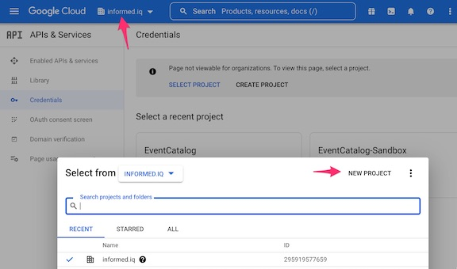

1. Fill in the New Project Form and click on `CREATE`
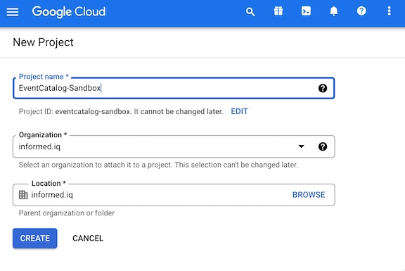

#### Create OAuth Consent and Credentials

1. Select `APIs & Services` from the menu bar on the left to go to that page of the project
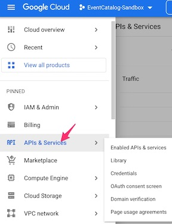

1. Select `Credentials` from the new menu bar on the left
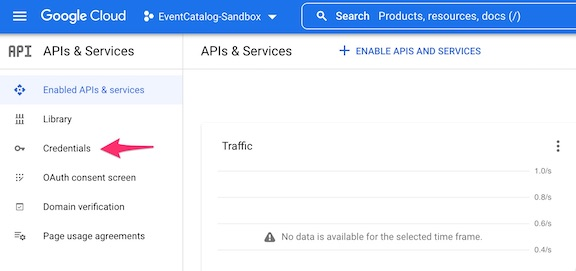

1. Click on `Configure Consent Screen` to configure the OAuth consent info
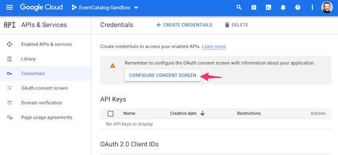
    1. Select `Internal` and then click on `CREATE`
    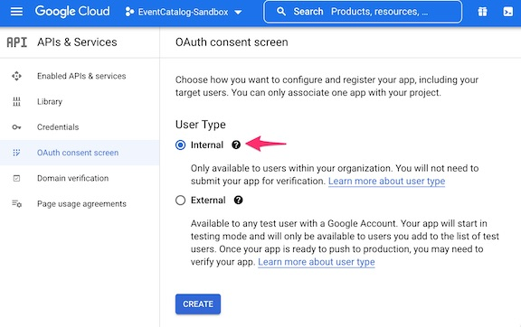
    1. Fill in at least 
        * App Name (`EventCatalog Sandbox`)
        * User Support email 
          * This will be a pulldown and should have the email associated with the Google Dev account
        * Authorized domains
          * This should be the domain used for the email address of people logging in via Google SSO.
          * In my case this is `informed.iq`
        * Developer contact information email address
          * Can be your email
    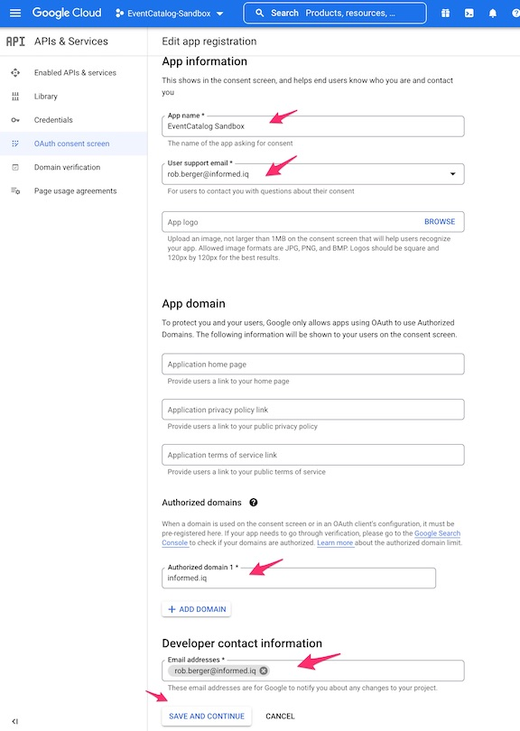
    1. Click `SAVE AND CONTINUE`
    1. Click `SAVE AND CONTINUE` on the next screen (`Scopes Page`)
    1. Click on `BACK TO DASHBOARD` on the next screen (`Summary Page`)
    1. Click on `Credentials` on the left hand nav bar to get back to the Credentials page
              
1. Click on `+ Create Credentials` on the top menu bar and select `OAuth client ID` from the pulldown
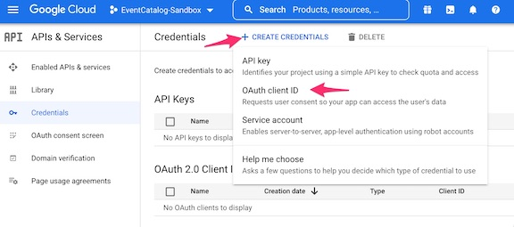

    1. Select **Web application** for the Application type
    1. Under **Authorized redirect URIs**, enter your Cloudfront hostname with your preferred path value for the authorization callback. For our working example: `https://eventcatalog-projectname.rob.informediq-infra.com/_callback`
    1. Click `CREATE` when done
    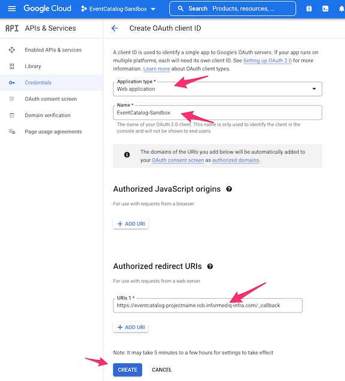
    
1. Capture the resulting OAuth Client ID and Secret
    * A modal window will show the OAuth Client ID and secret.
    * You should store that somewhere, though you can also always view it on the Google Console later
    * You can also download the JSON with the info and save it that way
    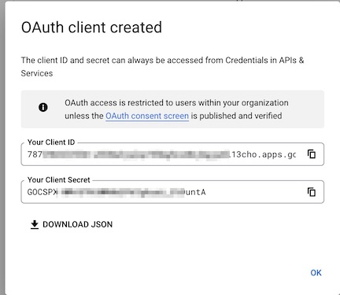
    
We're now done with the Google Developer's Console

### Generate the code for Lambda@edge

NOTE: Make sure you are in the `Widen/cloudfront-auth` directory for the following commands

Unfortunately, The `Widen/cloudfront-auth` project has not seen any updates in a while. But it is still widely used.

You can first run:
  ```shell
  npm audit fix --force
  ```
To at least remove some blatant high risk vulnerabilities. It seens to not impact the actual use of the project.

1. Execute `./build.sh`. NPM will run to download dependencies and a RSA key will be generated.
    * There will be some messages about the npm install
    * There is a `Warning` that seems to  be filling in the value of the first prompt `>: Enter distribution name:` you can ignore the warning and start filling in the values
      * `Distribution Name` - The value of `cf_domain_name` from the terraform run
      * `Authentication methods` - 1 Google
      * `Client ID` - The Client ID generated in the Google Console OAuth Credentials process
      * `Client Secret` - The Client Secret generated in the Google Console OAuth Credentials process
      * `Redirect URI` - The URL based on the domain name for the Cloudfront instance which was passed in the Google Console OAuth Credentials process
      * `Hosted Domain` - The email address domainname that will be used by people logging in via Google SSO
      * `Session Duration` - How many hours the session should last until the user needs to re-authenticate
      * `Authorization methods` - We are selecting `1` for `Hosted Domain`
      
    ```text
    >: Enter distribution name: d32pr2t6ww8z3r.cloudfront.net
    >: Authentication methods:
        (1) Google
        (2) Microsoft
        (3) GitHub
        (4) OKTA
        (5) Auth0
        (6) Centrify
        (7) OKTA Native

        Select an authentication method: 1
    Generating public/private rsa key pair.
    Your identification has been saved in ./distributions/d32pr2t6ww8z3r.cloudfront.net/id_rsa
    Your public key has been saved in ./distributions/d32pr2t6ww8z3r.cloudfront.net/id_rsa.pub
    The key fingerprint is:
    SHA256:vJS0/xcn4vAPChHdRx9bhf+QGbvq2qYRAdTNVyiE2ic rberger@tardis.local
    The key's randomart image is:
    +---[RSA 4096]----+
    |       .o. =. .==|
    |         oo.+.=.+|
    |        ooo .o.B.|
    |       o.+E...= .|
    |        S .o   o.|
    |       . +... + o|
    |        o o+.o + |
    |         . ==..  |
    |          +=+o.  |
    +----[SHA256]-----+
    writing RSA key
    >>: Client ID: 787***********************13cho.apps.googleusercontent.com
    >>: Client Secret: GOCSPX-****************untA
    >>: Redirect URI: https://eventcatalog-projectname.rob.informediq-infra.com/_callback
    >>: Hosted Domain: informed.iq
    >>: Session Duration (hours):  (0)  12
    >>: Authorization methods:
       (1) Hosted Domain - verify email's domain matches that of the given hosted domain
       (2) HTTP Email Lookup - verify email exists in JSON array located at given HTTP endpoint
       (3) Google Groups Lookup - verify email exists in one of given Google Groups

       Select an authorization method: 1
    ```  

1. Copy the resulting `zip` file found in the distribution folder in the Widen/cloudfront-auth directory to the `assets` directory in the terraform directory
    * The process will output the path that the zip file was saved as relative to.
    * In my setup the command to do the copy is:
  ```shell
  cp distributions/d32pr2t6ww8z3r.cloudfront.net/d32pr2t6ww8z3r.cloudfront.net.zip ../my-catalog/terraform/assets
  ```
## Deploy the EventCatalog content to S3

You can deploy the content manually. But you really should use aCI/CD systems to deploy the EventCatalog content.

### Manual deployment

First we'll show doing it manually

The key actions needed are to:

    * Change directory to be in the top of the EventCatalog repo
    * Build the static assets using the EventCatalog cli
    * Copy the static assets to the S3 bucket created by Terraform

1. Build the static assets 
    * Assumes you are in the top level of the EventCatalog Repo
    * You only need to do `yarn install` the first time you use any of the commands

  ```shell
  yarn install
  yarn build
  ```
1. Upload the static assets to S3

* Assumes you have installed the AWS CLI 
* You have configured you local shell environment with proper IAM Profile to run the AWS CLI
* Use the actual s3 bucket you created in your terraform run
  * The example shows the bucket we've used in our working example

  ```shell
  aws s3 sync .eventcatalog-core/out s3://informed-iq-rob-eventcatalog-origin
  ```

### Deployment with CircleCi

1. Assumes you have a [CircleCI account and have it hooked up to your Github account](https://circleci.com/integrations/github/).
    * It is beyond the scope of this article to show how to setup and use Github and CircleCI

1. You will need to set [CircleCi Project or Context environment variables](https://circleci.com/docs/2.0/env-vars):
    * `AWS_ACCESS_KEY_ID`
    * `AWS_SECRET_ACCESS_KEY`
    * `AWS_Region` (Needs to be `us-east-1`)

1. Create the `.circleci` directory at the top of your EventCatalog repo directory

1. Create a file `.circleci/config.yml` with the following content 

```yml
version: 2.1

# CircleCi Orbs (libraries) used by this config
orbs:
  node: circleci/node@5.0.2
  aws-s3: circleci/aws-s3@3.0.0

jobs:
  eventcatalog-contentbuild:
    docker:
      - image: cimg/node:16.15
    steps:
      - checkout

      - run:
          name: Install EventCatalog tooling
          working_directory: ~/project
          command: if [ ! -e "node_modules/@eventcatalog/core/bin/eventcatalog.js" ]; then yarn install; else echo "eventbridge seems to be cached"; fi;

      - run:
          name: Build the EventCatalog static content
          working_directory: ~/project
          command: |
            echo Running eventbridge build in `pwd`
            yarn build

      - aws-s3/sync:
          # Copy the static content to the S3 bucket
          aws-region: AWS_REGION
          from: ~/project/.eventcatalog-core/out
          to: s3://infomred-iq-rob-eventcatalog-origin

workflows:
  eventcatalog-contentworkflow:
    jobs:
      - eventcatalog-contentbuild:
          context:
            # We're getting the AWS Credentials from our CircleCI Organization context
            # You could also just use Project level Environment Variables with
            # IAM AWS_ACCESS_KEY_ID and AWS_SECRET_ACCESS_KEY
            - rberger-aws-user-creds
```

Once you have created this file and have all your commits in your EventCatalog Repo, push it to Github which should trigger your CircleCI run.

* You can confirm that it sent it to s3 by using the AWS Console or CLI to view the contents of the S3 bucket.

## Deploy the new lambda@edge code with terraform

1. Go back to your terraform directory.
    * Make sure the new zip file is in the `assets` directory

1. Update the tfvars input file (`sandbox.tfvars` in our working example) with the new filename
    * `lambda_file_name = "assets/d32pr2t6ww8z3r.cloudfront.net.zip"`
    ```
    region           = "us-east-1"
    profile          = "sandbox"
    fqdn             = "eventcatalog-projectname.rob.informediq-infra.com"
    alt_fqdn         = "eventcatalog.rob.informediq-infra.com"
    zone_id          = "Z10188613LLRJXN9ZCK7U"
    zone_name        = "rob.informediq-infra.com"
    lambda_file_name = "assets/d32pr2t6ww8z3r.cloudfront.net.zip"

    ```

1. Run `terraform apply`
  ```shell
  terraform apply -var-file=sandbox.tfvars
  ```

1. A successful run will display the output values

    * They should be something along the lines of the following:

```
Outputs:

cf_aliases = tolist([
  "eventcatalog-projectname.rob.informediq-infra.com",
  "eventcatalog.rob.informediq-infra.com",
])
cf_domain_name = "d32pr2t6ww8z3r.cloudfront.net"
s3_bucket = "infomred-iq-rob-eventcatalog-origin"
```

You should be able to go to ether of your cf_aliases.

* For instance:
   ```
   https://eventcatalog.rob.informediq-infra.com
   ```
* If you aren't already logged in, it should pass you to Google SSO authentication.
* Once you are logged in you should see the Home Page of the EventCatalog
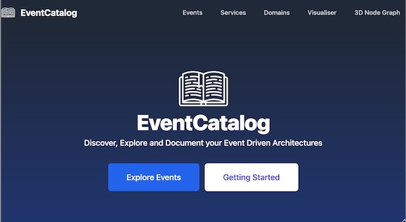

You can now start using the EventCatalog by updating the source files to fit your Domains, Services, and Events. 
